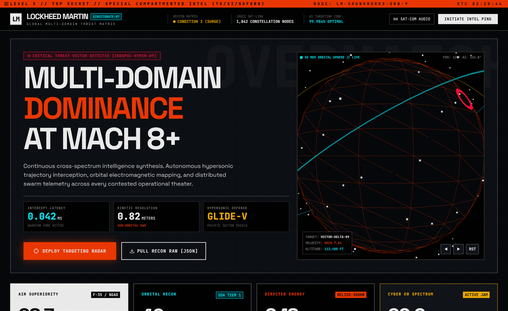
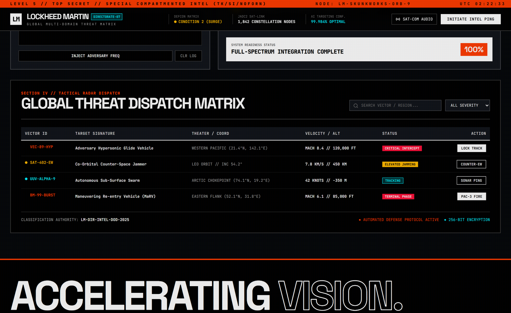

<p align="center">
  
</p>

<h1 align="center">Milsim Website Concept</h1>

<p align="center"><strong>Multi-domain dominance, as a landing page.</strong></p>

<p align="center">
  Static HUD / defense-contractor visual study.<br>
  One <code>index.html</code>. Tailwind CDN, Three.js globe, fake intel table.<br>
  Not Lockheed Martin. Not a product.
</p>

<p align="center">
  <a href="https://github.com/ShugokiFable/Cool-Milsim-Website-Concept/actions/workflows/ci.yml"></a>
  <a href="LICENSE"></a>
  
  
</p>

<p align="center">
  <a href="#open-the-page">Open the page</a>
  ·
  <a href="#what-you-get">What’s on the page</a>
  ·
  <a href="#honest-status">Honest status</a>
</p>

<p align="center">
  
</p>

<p align="center"><sub>Captured from <code>index.html</code> in this repository (local server, Microsoft Edge, Three.js globe rendered). Fictional UI.</sub></p>

## Why it exists

Milsim and “defense prime” sites share a look: classification banners, brutalist type, amber/cyan telemetry, a globe. This page is that look as a single file — a design reference, not a contractor portal.

The title string in the HTML is `LOCKHEED MARTIN // ADVANCED INTEL-DIR VECTOR MATRIX`. That is **set dressing**. This repository is not affiliated with, endorsed by, or related to Lockheed Martin Corporation.

GitHub Pages is **not** published for this repo.

## What you get

- Classification banner, DEFCON / SAT-link / AI-confidence header metrics
- Hero: “MULTI-DOMAIN DOMINANCE AT MACH 8+” plus a live Three.js wireframe globe
- Inverted metric tiles (air / orbital / directed energy / EW)
- RF spectrum waterfall canvas and SIGINT-style terminal log
- Searchable **Global Threat Dispatch Matrix** (`#threat-matrix`)
- Footer lockup that names Skunk Works as a Lockheed Martin trademark (copied as part of the parody HUD, not as a rights grant)

<p align="center">
  
</p>

<p align="center"><sub>Same capture pass, scrolled to <code>#threat-matrix</code>.</sub></p>

## Open the page

Needs a network connection on first load: Tailwind CDN, Three.js r128, Lucide, Google Fonts (Chakra Petch, JetBrains Mono, Space Grotesk).

```powershell
git clone https://github.com/ShugokiFable/Cool-Milsim-Website-Concept.git
cd Cool-Milsim-Website-Concept
python -m http.server 4173
```

Open [http://127.0.0.1:4173](http://127.0.0.1:4173).

Double-clicking `index.html` as `file://` often works, but CDN scripts are happier on `http://127.0.0.1`.

## Project map

```text
index.html          the entire dashboard (markup, CSS, Three.js, table JS)
.github/workflows   tidy (errors fail) + lychee offline link check
docs/images/        mark.svg, hero.png, threat-matrix.png
LICENSE             MIT
```

No npm, no bundler, no backend. Buttons mutate the in-page log / table only.

## Development

CI on `main`:

```text
tidy -errors     HTML errors fail the job; warnings are tolerated
lychee --offline internal hrefs and anchors only
```

External CDNs are **not** gated by CI (`lychee --offline`). If Tailwind or Three.js is unreachable, the page degrades.

## Honest status

Verified in this tree:

- single static page with globe, waterfall, and filterable table
- screenshots above taken from that page
- CI workflow present

Not claimed:

- any relationship with Lockheed Martin, Skunk Works, JADC2, or a real defense program
- classified data, live radar, or a real intel feed
- GitHub Pages / production hosting
- a game, milsim unit, or recruitment funnel

## License

[MIT](LICENSE) for this HTML/CSS/JS concept.

Lockheed Martin, Skunk Works, and related marks belong to their owners. This page is unofficial fiction.
